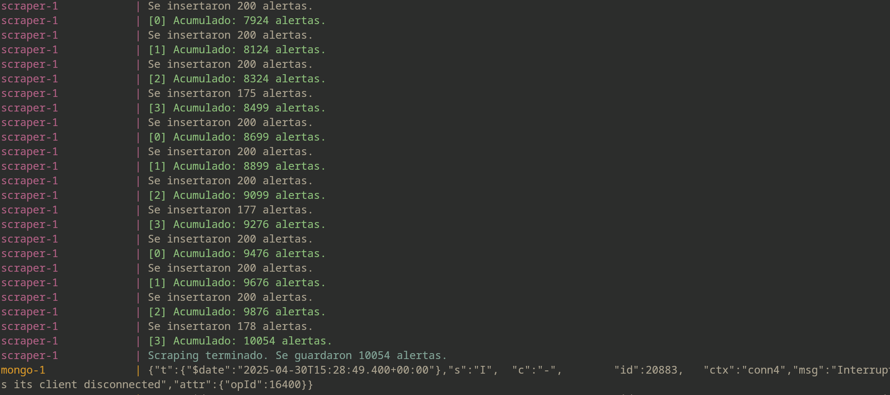
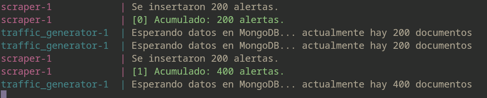
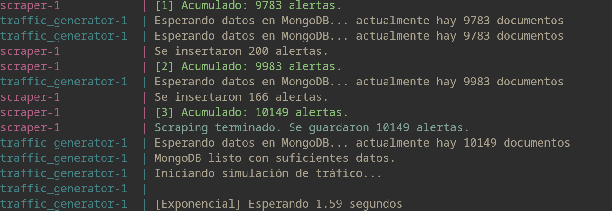
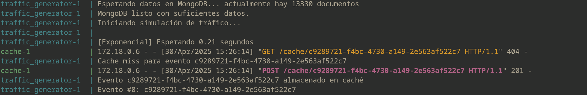
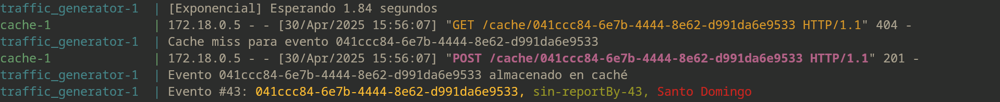
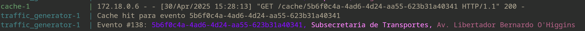
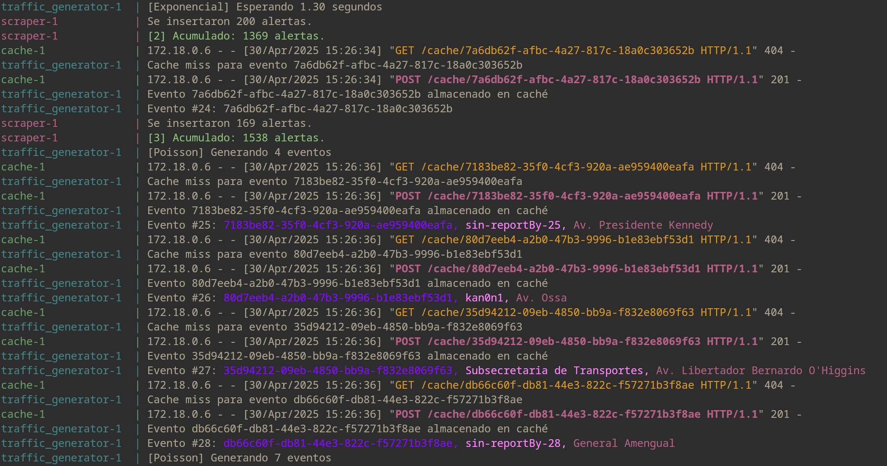
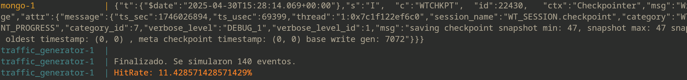
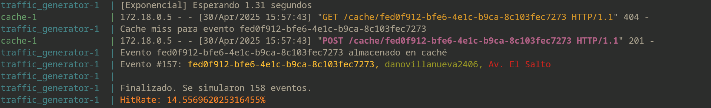

# Waze Scraper
## Configuración previa
Para iniciar nuestro **Waze Scraper** primero se debe clonar el repositorio para eso escoge tu *caperta* de preferencia:
- Si estásen linux (recomendado):

    `cd tu_carpeta/`


Lego para clonar el repositorio puedes hacer:
```
git clone https://github.com/AlexMarambio/Sistema_Distribidos_TAREAS.git
```
## Levantamiento ecosistema
Una vez clonado debes ingresar a la carpeta *raiz* de nuestro repositorio:
```
cd Sistema_Distribidos_TAREAS/
```

### Build y levantamiento
En un solo comando puedes buildear y correr el programa:
```
docker-compose up --build
```
También puedes hacerlo separado:
- Notar que el flag `--no-cache` es solo por si ya ha corrido antes el programa y ha hecho alguna modificación. Se puede omitir.
```
docker-compose build --no-cache
```
```
docker-compose up
```

#### Comprobaciones (opcional)
Para asegurar de que realmente se guardaron los datos scrapeados se puede hacer mientras siga en pie el ecosistema:
**Abrir otra terminal** para no interrumpir el docker-compose.
`docker ps`
Ahí saldrán los tres contenedores, buscar el que se llama **mongo** y copiar su *id*:
```
docker exec -it <id_del_contenedor_mongo> mongosh
```
Una vez dentro se puede comprobar la cantidad de datos y algunos de estos ocupando:
```
use waze-alerts
```
- Para entrar a la BDD de las alertas.
```
db.alerts.countDocuments()
```
- Para obtener el total de eventos; Si teminó de ejecutar el escraper por completo sadrán la misma cantidad que aparece en la consola del docker-compose.
```
db.alerts.find().limit(3).pretty()
```
- Se mostraran 3 de las alertas (se puede cambiar el número).

### Cerrar todo
En caso de querer cancelar la ejecución puedes hacer `ctrl + c` y luego:
```
docker-compose down
```

# Ejecución
## ¿Qué esperar que ocurra?

Primero, si se ejecuta por primera vez se esperara a que se rellene la BDD por lo que aparecerá algo como esto:

Una vez ya está listo se comenzará el tráfico:



Se podrá ver con distintos colores los eventos que procesa, el tráfico se realizara ocupando una distribución **exponencial** (generando tiempo de espera) o con **poisson** (generando eventos simultaneos aleartorio). Y se verá si se hizo *hit* o *miss*.




### Final tráfico
Se podrá ver lña taza de hit que hubo:

